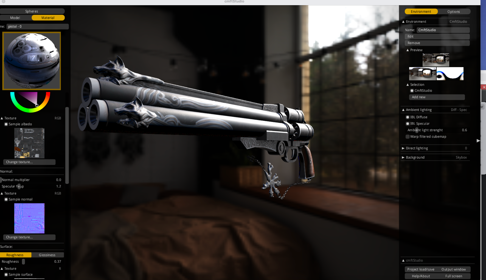

# Qt PBR

此工程主要基于Qt OpenGL实现PBR效果，目标是实现cmftStudio引擎搭建的效果

## 待实现
1. skybox 模糊效果，突出渲染主体
2. 离线工具：生成Radiance和Irradiance，用来间接光IBL渲染

| 类型 | 用途 | 特点 |
|------|------|------|
| Skybox | 背景 + 直接光照参考 | 原始 HDR 图像，未过滤 |
| Radiance | 镜面反射（Glossy） | 经过 mipmap 和卷积滤波，保留高频细节 |
| Irradiance | 漫反射光照（Diffuse） | 极度模糊，低频信息，用于计算物体受光 |

